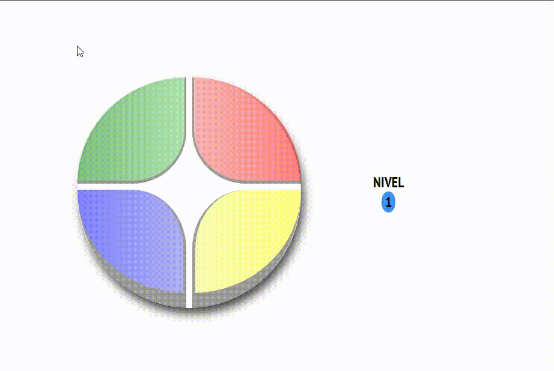
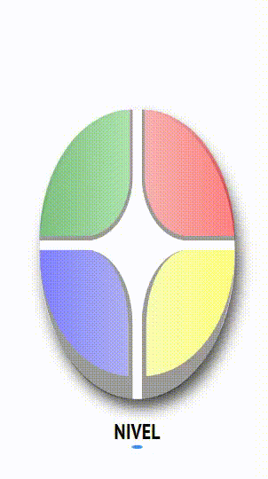

# Game-Genius
Recriando o jogo Genius com Javascript, desafio proposto no Bootcamp Eduzz Fullstack. 🎮

## 🔧 Melhorias:

<li>Corrigido bug no código original que fazia com que às vezes o brilho da última cor a ser clicada não apagasse;</li>
<li>Adicionar responsividade;</li>